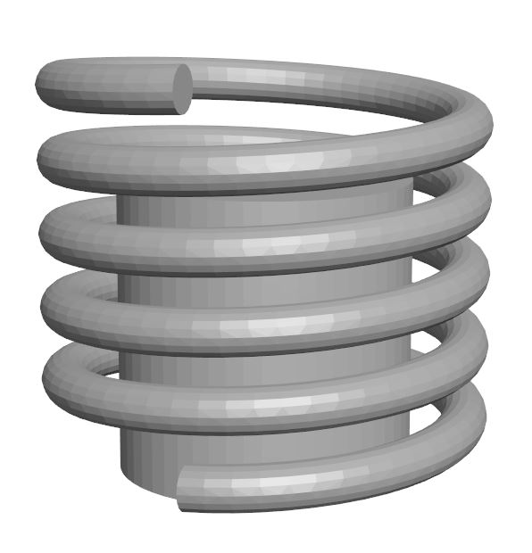
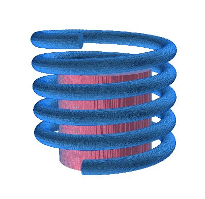
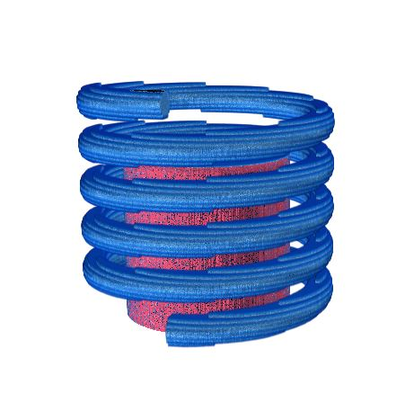

# OpenGL Voxelizer

This is a standalone voxelizer based on OpenGL. It is based on [OpenGL-STL-slicer](https://github.com/3D-Printing-for-Microfluidics/OpenGL-STL-slicer).

## Requirements
- numpy
- [tqdm](https://anaconda.org/conda-forge/tqdm)
- [pyopengl](https://anaconda.org/anaconda/pyopengl)
- [pyglet](https://anaconda.org/conda-forge/pyglet)
- [trimesh](https://anaconda.org/conda-forge/trimesh)


## Notes

The voxelizer uses the .stl file coordinates to determine the position of the voxelized mesh in the voxel array. When using the voxelizer for VAM, the mesh should be oriented in CAD space such that the axis which is to be along the rotation axis of the vial is the z-axis.
The minimum bound of an object should be equal to zero in the z-axis, e.g., `min(mesh_z_coordinates)=0`. 
The x and y position in space is also considered. This is especially important when more 2 or more meshes that are somehow related in physical space are voxelized. 
Ideally, the center of the mesh should be near `(x,y) = (0,0)` and `min(mesh_z_coordinates)=0`. This will ensure that the voxel array size is not expanded to fit meshes that are located at a large `(x,y)` offset from the origin.

## Example

The coil and core meshes have been exported from CAD as separate .stl files but since they were drawn within the same physical coordinate space, they have the same origin. Thus, when they are voxelized as in the example, the voxel arrays reflect their respective positions.


``` python
import openglvoxelizer

vox = openglvoxelizer.Voxelizer()
vox.addMeshes({
    r'coil.stl':'print_body',
    r'core.stl':'attenuating_body',
    })

print_body = vox.voxelize('print_body',xy_voxel_size=0.01,z_voxel_size=0.01,voxel_value=1)
attenuating_body = vox.voxelize('attenuating_body',xy_voxel_size=0.01,z_voxel_size=0.01,voxel_value=2)

combined = print_body + attenuating_body
```

The voxel arrays can be saved to the disk with numpy
``` python
import numpy as np
np.save(r'combined_array.npy',combined)
np.save(r'print_body_array.npy',print_body)
np.save(r'attenuating_body_array.npy',attenuating_body)
```

Note that the voxel value for the coil was set to be 1 and the core was set to be 2. This is why the colors of voxels in each body appear differently: voxel_value = 1 is blue, voxel_value = 2 is red. The array was visualized using [Tomviz](https://tomviz.org/).



Non-isotropic voxel sizes in x-y and z dimensions are also supported. Below, the z voxel size is 10 times larger than the x-y voxel size.

``` python
print_body = vox.voxelize('print_body',xy_voxel_size=0.01,z_voxel_size=0.1,voxel_value=1)
attenuating_body = vox.voxelize('attenuating_body',xy_voxel_size=0.01,z_voxel_size=0.1,voxel_value=2)

combined = print_body + attenuating_body
```

